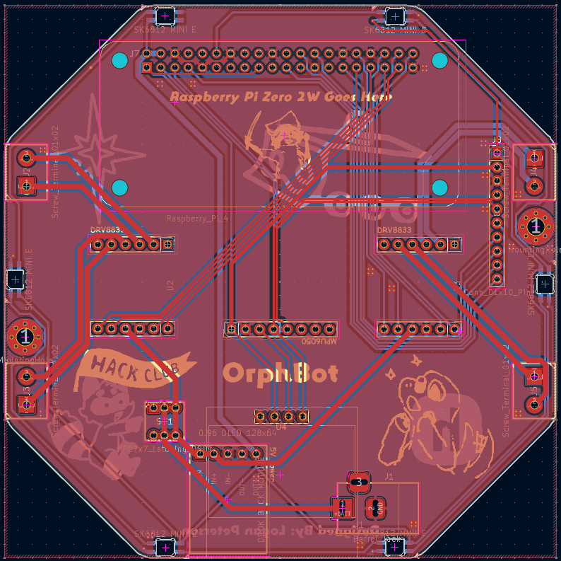
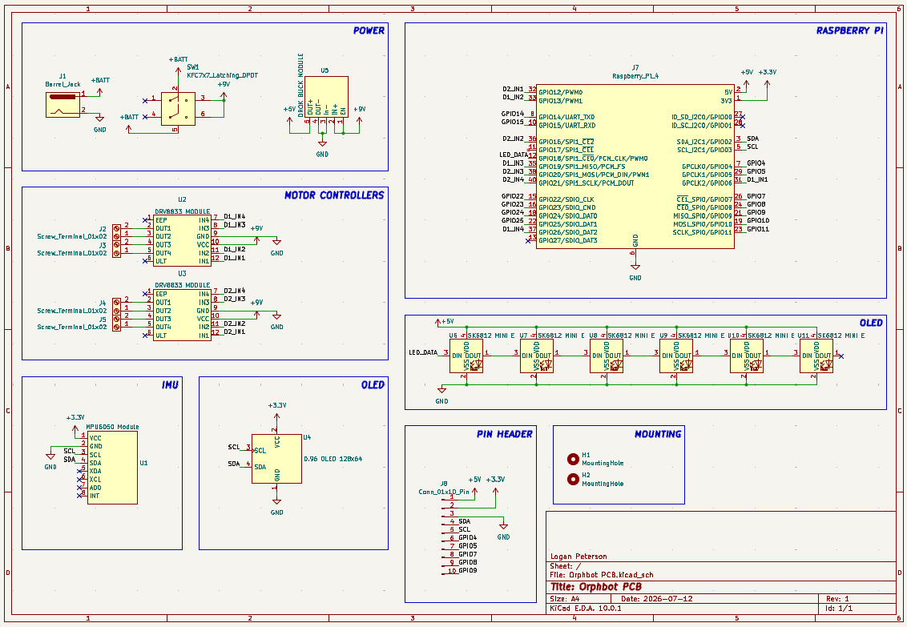

# OrphBot

Orphbot is a 4 wheeled robot with a small lifter on its front. It runs ROS 2 and has a couple autonomous routines.

It serves as an example for the [Waypoint YSWS](https://www.waypoint.hackclub.com), since it implements every component that comes in the kit.

## Features:

* Top Sanded Acrylic Plate
* 128x64 OLED Display
* A 9v Battery
* 6 SK6812 MINI E LEDs
* 4 Drive Motors
* An MPU6050

## CAD:

Everything fits together using 8 M3 Bolts and heatset inserts. Two for the PCB and four for the case.

It has 3 separate 3D printed parts. The main body, as well as 2 side parts to better hide the wheels. It also has 1 main acrylic top plate, which gets sanded to make opaque.

(Picture goes here whenever I finish CAD)

## PCB:

Heres what the PCB looks like! It was made in KiCAD.

## Firmware:

This robot uses ROS2! Its package is inside the repo under the [Firmware](Firmware/) folder.

* It can connect and display its information to RViz
* It connects to an Xbox controller for control
* The robot can run some simple preprogrammed automous missions
* The OLED displays a small fluid simulation!

## BOM:

The BOM is not included yet.

## Extra stuff

Put something fun or interesting here! Inspiration for the project? Your favorite meme? A joke? Up to you.