Welcome to the first part of your robot! This guide takes you from a blank KiCad project to a routed and checked Waypoint robot-controller PCB.

For this guide we're using [KiCad](https://www.kicad.org/), an open source PCB design tool.

## Start The Schematic

First, open KiCad and create a project for your robot.

To start, import the needed symbols and footprints: [How to Import KiCad Libraries](/reference/how-to-import-kicad-libraries/). Symbols are the parts you place in the schematic. Footprints are the physical shapes that appear on the PCB.

After importing, your project should contain both library files:

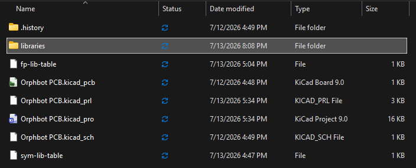

Now open the schematic editor.

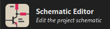

The schematic shows which pins connect to each other.

Press `A` to add a symbol. Search for `WaypointCarePackage:DROK_BUCK_MODULE`. If it appears, the symbol library is working.

### Power

The power section gives the board the voltages the robot needs and adds a power switch.

Press `A` and add:

- `Connector:Barrel_Jack`
- `WaypointCarePackage:KFC7x7_Latching_DPDT`
- `WaypointCarePackage:DROK_BUCK_MODULE`

Place them roughly like this:

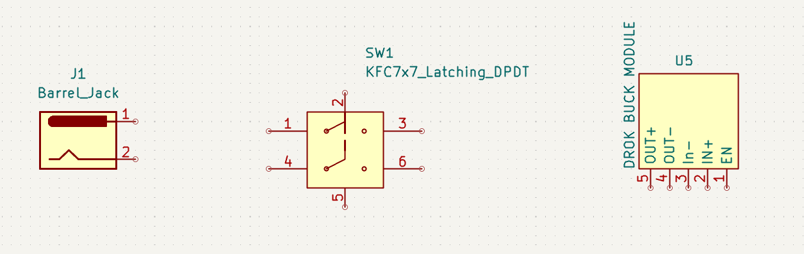

Press `P` to add power symbols. Place `+BATT`, `+9V`, `+5V`, and `GND`.

Press `W` to draw wires. Wire the barrel jack, switch, buck converter, and power symbols to match the completed section below. The buck input and `EN` pin go to switched `+9V`, the buck negative pins go to `GND`, and the output goes to `+5V`.

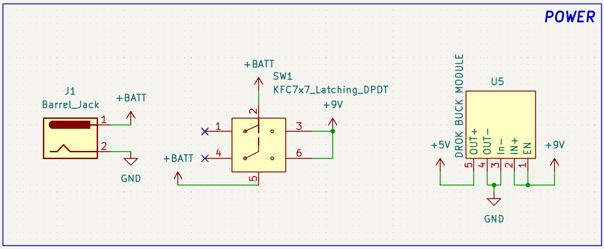

:::tip[Tip]
It is good practice to put related electrical components together inside a rectangle with text that names what they do.
:::

When you reach an unused pin, press `Q` to place a no-connect marker. That tells KiCad, and anyone reviewing your design, that the pin is intentionally unused.

:::caution
Do not connect battery voltage directly to the 5V rail. This rail should only receive regulated 5V from the buck converter.
:::

### Motor Drivers

The motor drivers let the Raspberry Pi control the motors.

Press `A` and add two `WaypointCarePackage:DRV8833_MODULE` symbols and four `Connector:Screw_Terminal_01x02` symbols.

Connect each DRV8833 to `+9V` and `GND`. Connect the four motor-output pairs to the four screw terminals, just like this:

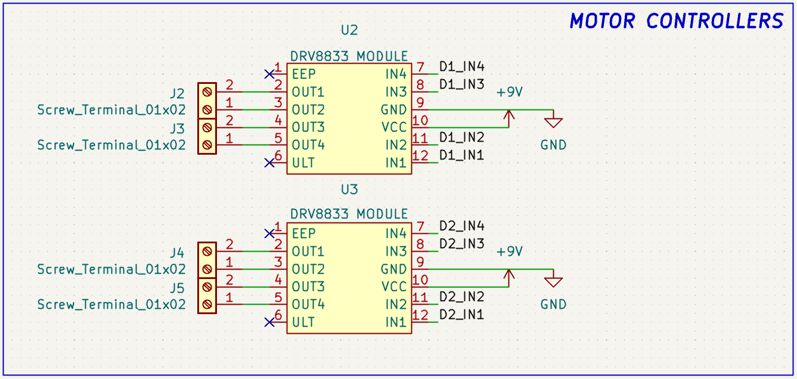

This is where labels are easier than long wires. Press `L` to add net labels for the motor inputs:

```text
D1_IN1
D1_IN2
D1_IN3
D1_IN4
D2_IN1
D2_IN2
D2_IN3
D2_IN4
```

### IMU

The MPU6050 lets the robot sense movement.

Press `A` and add `WaypointCarePackage:MPU6050_MODULE`. Connect `VCC` to `+3.3V`, connect `GND`, and label the I2C pins `SDA` and `SCL`. Mark unused pins with `Q`.

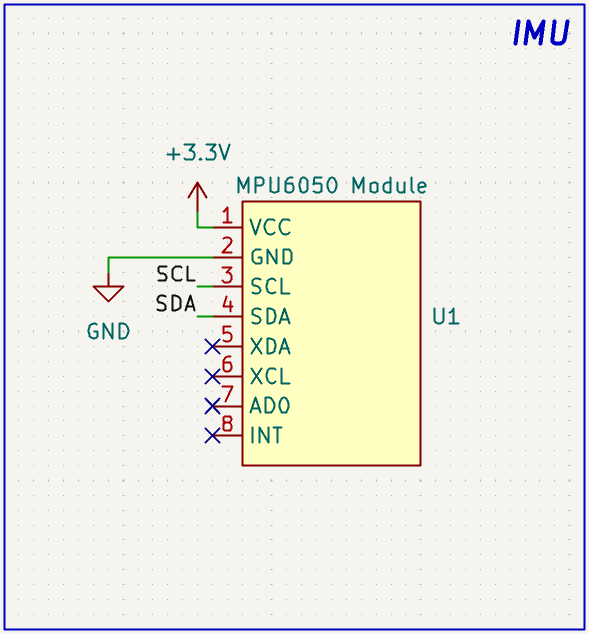

### Raspberry Pi

The Raspberry Pi controls the motor drivers and communicates with the IMU.

Press `A` and add `Connector:Raspberry_Pi_4`. This symbol gives you the standard 40-pin Raspberry Pi header.

Use this pinout while you connect the labels:

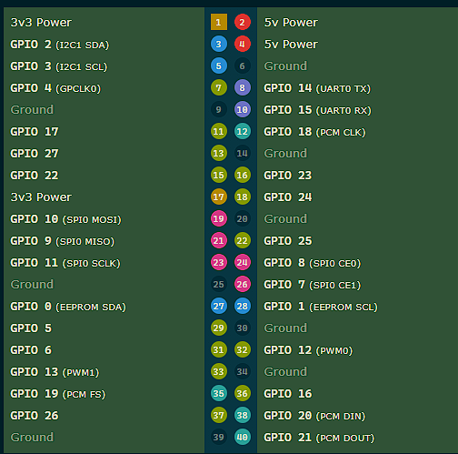

Connect `+5V`, `GND`, and the Pi 3.3V pin. Connect `SDA` to physical pin 3, `SCL` to physical pin 5, and the `D1_IN*` and `D2_IN*` labels to GPIO pins.

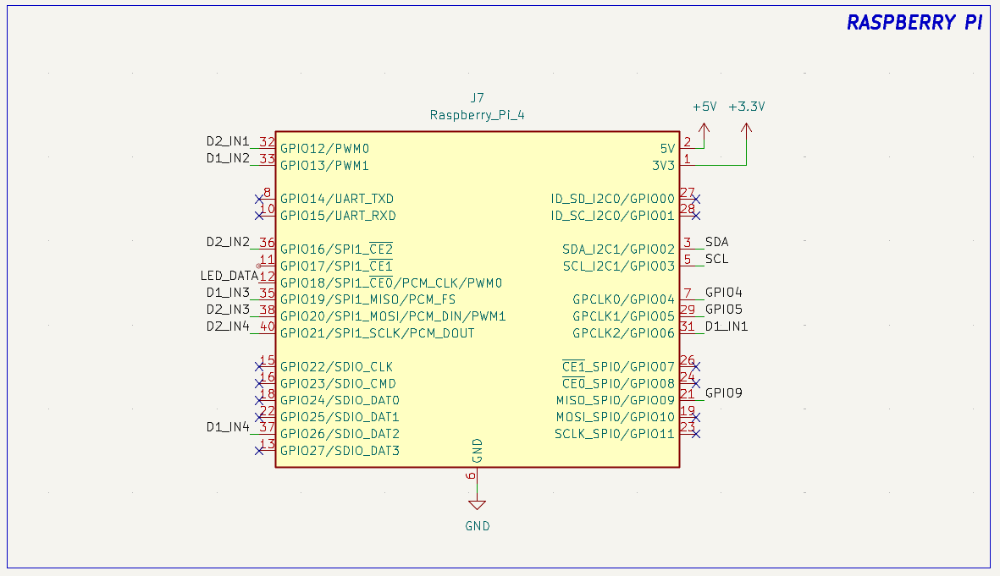

### Bonus Feature And Mounting

Add a spare header or another small feature that makes the board yours.

Press `A` and add a spare header such as `Connector:Conn_01x10_Pin`. For a smaller feature, use the matching pin count, like `Connector:Conn_01x03_Pin` for a 3-pin servo header. Wire useful pins such as `GND`, `+5V`, `+3.3V`, `SDA`, `SCL`, and extra GPIO.

Here's an example breakout on Orphbot:

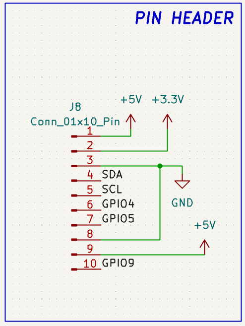

For a servo header, use this order:

```text
GND
+5V
PWM-capable GPIO
```

Most Raspberry Pi GPIO pins can do software PWM. GPIO12, GPIO13, GPIO18, and GPIO19 are easy PWM-capable choices.

Add M3 mounting holes with `Mechanical:MountingHole`.

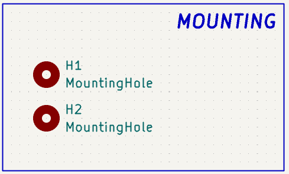

### Check And Assign Footprints

Run **Inspect > Electrical Rules Checker**. Fix real errors before moving into the PCB editor.

Footprints are the physical shapes that will appear on the PCB. Open the footprint assignment tool.

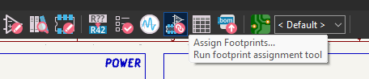

Some rows may be blank at first.

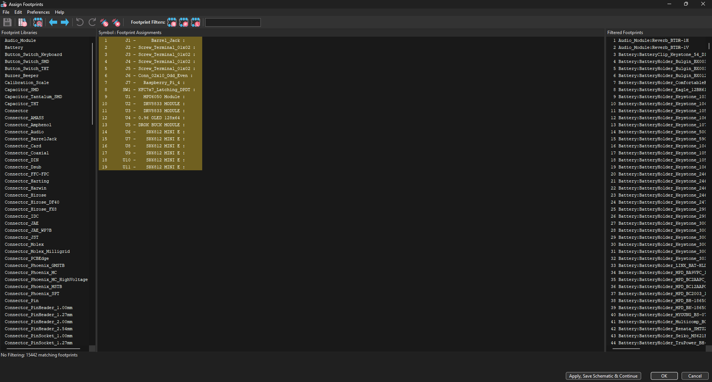

Use these assignments for the main parts you can find in your kit:

| Symbol | Footprint |
| --- | --- |
| `Connector:Barrel_Jack` | `Connector_BarrelJack:BarrelJack_Horizontal` |
| `WaypointCarePackage:KFC7x7_Latching_DPDT` | `WaypointCarePackage:KFC7x7_Latching_DPDT_Blue` |
| `WaypointCarePackage:DROK_BUCK_MODULE` | `WaypointCarePackage:LOW_DROK_BUCK_MODULE` |
| `WaypointCarePackage:DRV8833_MODULE` | `WaypointCarePackage:DRV8833_MODULE` |
| `Connector:Screw_Terminal_01x02` | `WaypointCarePackage:TerminalBlock_KF301-2P_P5.08mm_Blue` |
| `WaypointCarePackage:MPU6050_MODULE` | `WaypointCarePackage:LOW_MPU6050_MODULE` |
| `Connector:Raspberry_Pi_4` | `WaypointCarePackage:MODULE_RASPBERRY_PI_ZERO_2_W` |
| `Connector:Conn_01x#_Pin` | `Connector_PinHeader_2.54mm:PinHeader_1x#_P2.54mm_Vertical` |
| `Mechanical:MountingHole` | `MountingHole:MountingHole_3.2mm_M3_Pad_Via` |

:::tip[Note]
The library includes normal and low variants of some module footprints. Low parts can sometimes fit under taller parts, but you should confirm that in the 3D viewer before routing. For header footprints, replace `#` with your pin count.
:::

These are the ones I picked:

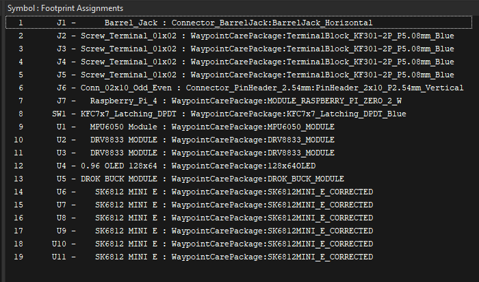

Apply the changes and save.

## Place And Outline The PCB

Open the PCB editor.

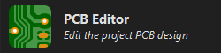

Press `F8` to update the PCB from the schematic. KiCad will import the footprints. The thin connection lines are the ratsnest, and the gold/copper pads are the places tracks can start or end.

Press `M` to move a footprint and `R` to rotate it. Put connectors near board edges, motor drivers near motor terminals, and the Pi where its USB ports are reachable.

If you want a footprint on the opposite side of the PCB, select it and press `F`, or right-click and choose **Flip**. This moves it between the front and back of the board.

Select the `Edge.Cuts` layer and draw the board outline around your parts. Use the measure tool to check the board size.

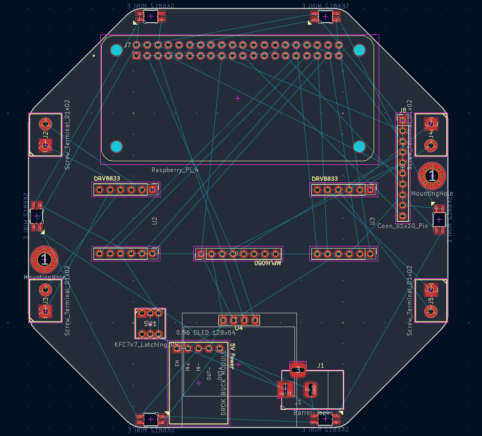

:::tip[Tip]
Be intentional in your part placements, and dont be afraid to move things around as you work on your design! For example, I have LEDs on my PCB facing downwards to provide my robot with underglow lighting!
:::

### Check The Fit In 3D

Before routing, check that the parts physically fit together.

Open **View > 3D Viewer**. Rotate around the board and look for parts intersecting each other, connectors blocked by other parts, or modules sitting where they cannot actually be installed.

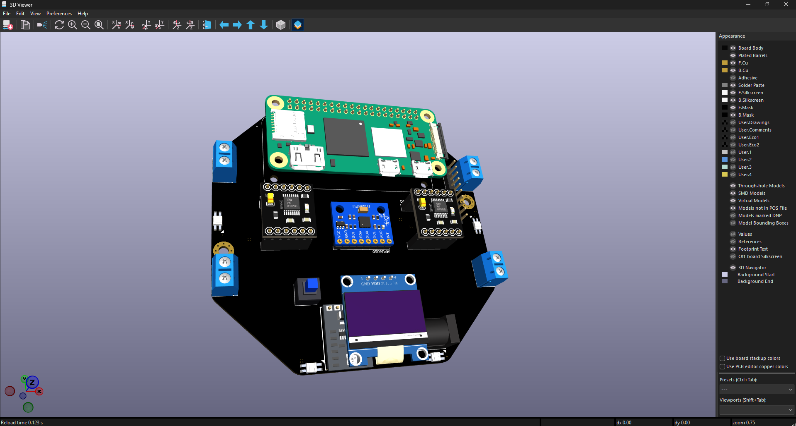

If two parts overlap in 3D, move one of them or choose a different footprint height before you route traces.

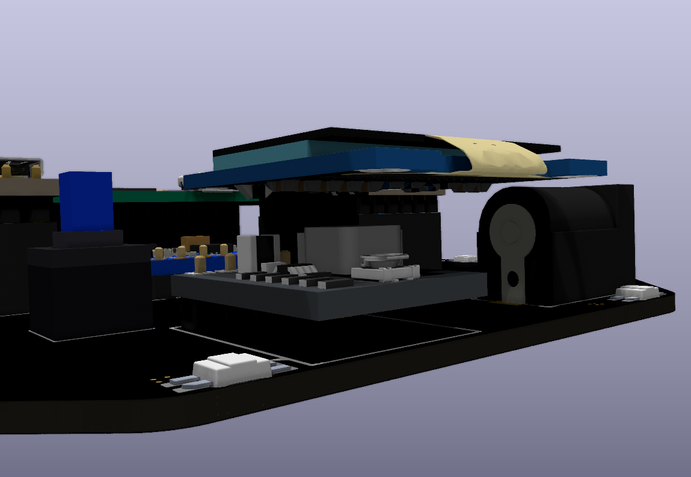

### Set Trace Widths

Set up trace widths before routing so you can quickly switch between small signal traces and larger power or motor traces.

Open the predefined track-width editor from the PCB editor toolbar.

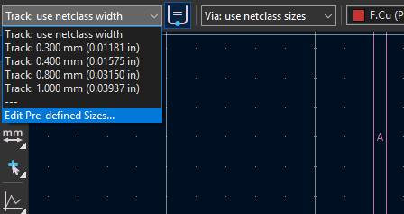

Add at least one normal width for GPIO and I2C, plus a larger width for motor and power connections. During routing, pick the width that matches the connection you are drawing.

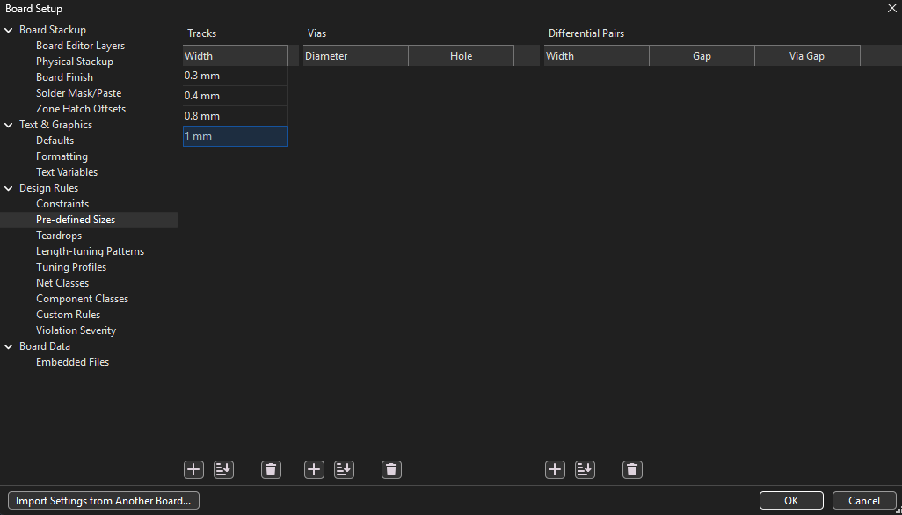

### Add A GND Pour

A GND copper pour fills empty board space with copper that connects to GND. It can simplify routing because many ground pads connect to the pour instead of needing individual ground traces.

Click the copper-zone tool.

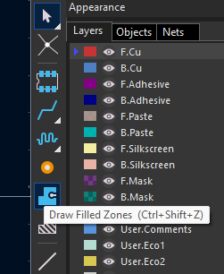

Set the net to `GND`, choose both copper layers, and draw the zone around the board area. Press `B` to refill zones after you create or edit traces.

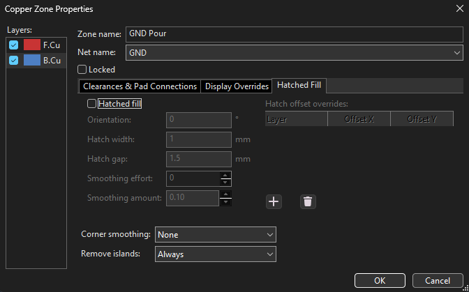

### Route The Board

Routing turns the ratsnest into copper tracks.

Press `X`, click a connected pad, follow the ratsnest, and click the destination pad. Use `F.Cu` for front copper and `B.Cu` for back copper. If you need to change layers while routing, press `V` to place a via.

Use the wider predefined trace width for power and motor paths. Use the smaller width for GPIO and I2C.

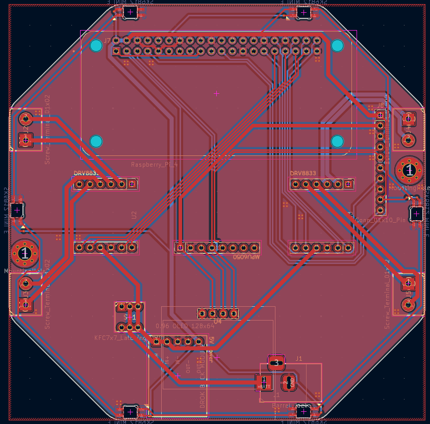

## Polish And Check

Add silkscreen labels for motor outputs, header pins and your name. You can also add art to make the board feel finished.

Heres examples from my board:

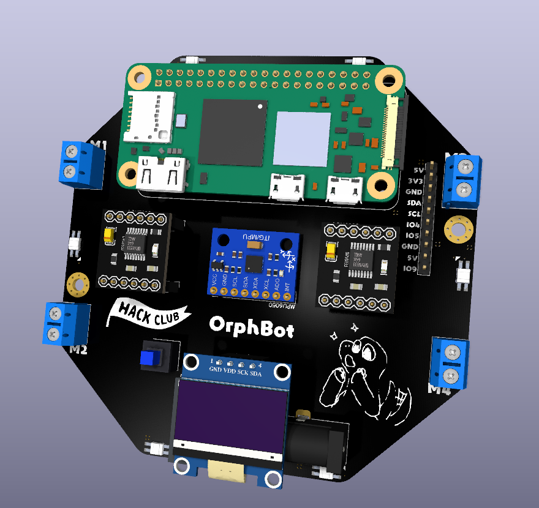

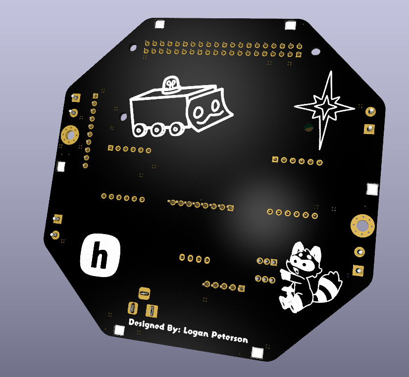

Google `KiCad silkscreen art` or `KiCad image converter silkscreen` if you want to get creative; there are tons of tutorials online!

Run **Inspect > Design Rules Checker** and fix real errors. The example below shows checks intentionally ignored for this board and what a clean no-violations result looks like. ***Do not ignore unrouted net errors!***

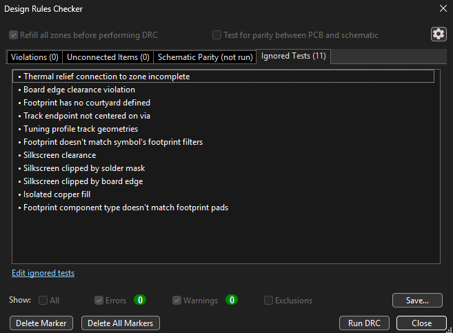

:::danger[Remember!]
You need to add some other feature to the PCB for your submission! This could be an OLED, LEDs, etc. Get creative!
:::

That's it! You now have a routed and ready robot control PCB!